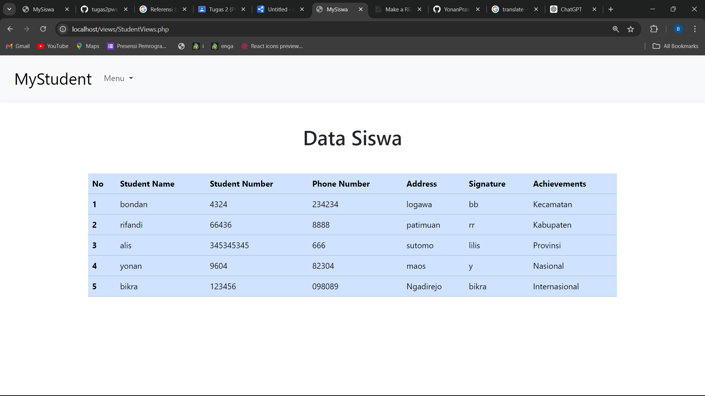
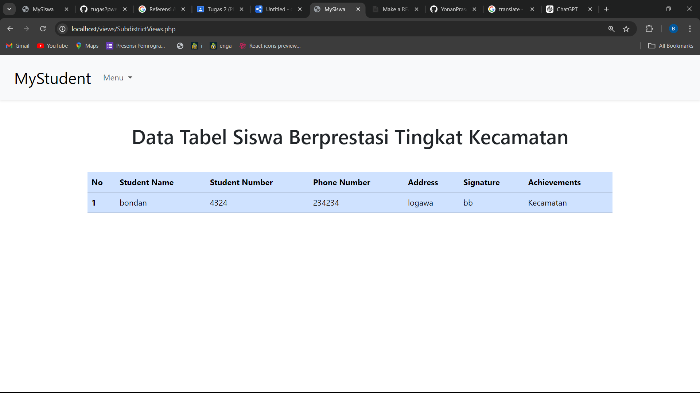

# TUGAS II Praktikum WEB II

Mengimplementasikan Read untuk menampilkan data sesuai role dengan PHP OOP

## Tentang saya

Nama : Bikra Abna Filqiyast Dzaki \
NIM : 230302005 \
Kelas : TI-2A \

## Database yang Digunakan


## Task I

Membuat Project OOP dengan View Based menggunakan tabel Mahasiswa dan Prestasi dari database

## Task II

Membuat koneksi di dalam method __construct() didalam class Parent/Superclass

```php
class DB {
    // Properti private untuk menyimpan informasi koneksi database.
    private $host = 'localhost'; // Nama host database.
    private $user = "root"; // Nama pengguna database (default pada XAMPP atau LAMP).
    private $pass = ""; // Kata sandi pengguna database (default kosong pada XAMPP atau LAMP).
    private $db = "db_siwali"; // Nama database yang akan digunakan.
    
    // Properti protected untuk menyimpan objek koneksi database.
    protected $conn;

    // Konstruktor kelas DB yang akan dijalankan saat instansiasi objek.
    public function __construct(){
        // Membuat koneksi ke database menggunakan kelas mysqli dan menyimpannya di properti $conn.
        $this->conn = new mysqli($this->host, $this->user, $this->pass, $this->db);

        // Mengecek apakah terjadi kesalahan saat melakukan koneksi ke database.
        if ($this->conn->error) {
            // Jika terjadi kesalahan, program akan dihentikan dan menampilkan pesan error.
            die("Connection failed: " . $this->conn->error);
        }
    }
}
```

## Task III

Menerapkan Enkapsulasi di dalam Project

```php
private $host = 'localhost';
``` 
Attribute dengan visibilitas private untuk membatasi akses data di dalam atribut $host agar tidak bisa di akses di class Children/SubClass maupun saat instansiasi class. 

```php
protected $conn;
```

Attribute dengan visibilitas private untuk membatasi akses data di dalam atribut $conn agar tidak bisa di akses di luar class Parent/Superclass dan class Children/Subclass akan tetapi tetap bisa di akses didalam class Parent dan Children.

```php
public function $read(){
 ...
}
```
Method dengan visibilas public agar bisa di akses saat instansiasi

## Task IV

Membuat kelas turunan menggunakan konsep Inheritance (Pewarisan)

```php
class DB {

...

}

interface Read {

   ...

}

class District extends DB implements Read {

...

}
```
Kelas DB adalah parent class yang menyediakan fungsionalitas dasar, interface Read mendefinisikan kontrak metode yang harus diimplementasikan, dan kelas District adalah child class yang mewarisi fungsionalitas DB sekaligus mengimplementasikan metode dari Read.

## Task V

Menerapkan konsep Polymorphisme dalam project, setidaknya untuk 2 peran

```php
class DB {

...

}

interface Read {
    public function read(); 
}

class Student extends DB implements Read {

...

       public function read(){
        $sql = "SELECT student.*, achievements.achievement_type AS nama_prestasi 
                FROM student 
                JOIN achievements ON student.id_achievements = achievements.id_achievements";
        
        return $this->conn->query($sql);
    }
}

class District extends DB implements Read {

...

    public function read(){
        $sql = "SELECT student.*, achievements.achievement_type AS nama_prestasi 
                FROM student 
                JOIN achievements ON student.id_achievements = achievements.id_achievements 
                WHERE student.id_achievements = 2";

        return $this->conn->query($sql);
    }
}

class Internationals extends DB implements Read {

...

    public function read(){
        $sql = "SELECT student.*, achievements.achievement_type AS nama_prestasi 
                FROM student 
                JOIN achievements ON student.id_achievements = achievements.id_achievements 
                WHERE student.id_achievements = 5";

        return $this->conn->query($sql);
    }
}

class Nasionals extends DB implements Read {

...

    public function read(){
        $sql = "SELECT student.*, achievements.achievement_type AS nama_prestasi 
                FROM student 
                JOIN achievements ON student.id_achievements = achievements.id_achievements 
                WHERE student.id_achievements = 4";
        
        return $this->conn->query($sql);
    }
}

class Province extends DB implements Read {

...

    public function read(){
        $sql = "SELECT student.*, achievements.achievement_type AS nama_prestasi 
                FROM student 
                JOIN achievements ON student.id_achievements = achievements.id_achievements 
                WHERE student.id_achievements = 3";
        
        return $this->conn->query($sql);
    }
}

class Subdistrict extends DB implements Read {

...

    public function read(){\
        $sql = "SELECT student.*, achievements.achievement_type AS nama_prestasi 
                FROM student 
                JOIN achievements ON student.id_achievements = achievements.id_achievements 
                WHERE student.id_achievements = 1";
        
        return $this->conn->query($sql);
    }
}

```

Implementasi method read() dari interface Read di berbagai kelas (District, Internationals, Nasionals, Province, Student, dan Subdistrict). Meskipun semua kelas ini mengimplementasikan method read() yang sama, setiap kelas memiliki logika SQL yang berbeda sesuai dengan kriteria id_achievements yang spesifik. Ini adalah contoh polimorfisme di mana satu method yang sama (dalam hal ini read()) memiliki implementasi yang berbeda tergantung pada kelasnya, sehingga memungkinkan perilaku yang bervariasi sesuai dengan kebutuhan setiap kelas.

# Hasil

## 1. Tampilan Awal/Tampilan Utama yang menampilkan semua data Mahasiswa


## 2. Tampilan Data Mahasiswa berprestasi tingkat Internasional


## 3. Tampilan Data Mahasiswa berprestasi tingkat Nasional


## 4. Tampilan Data Mahasiswa berprestasi tingkat Provinsi


## 5. Tampilan Data Mahasiswa berprestasi tingkat Kabupaten


## 6. Tampilan Data Mahasiswa berprestasi tingkat Kecamatan


# About Me
IG : @bikraaa_ \
Github : https://github.com/bikraabn1
